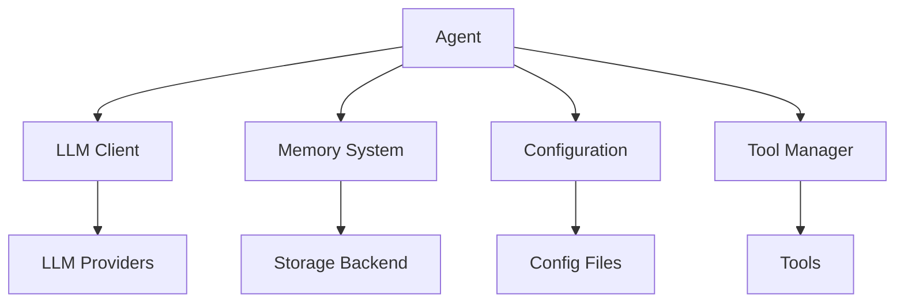

# Core Module Organization

## Overview
The core modules form the foundation of the personal agent, providing the essential functionality for operation. These modules are designed to be loosely coupled but highly cohesive, following the single responsibility principle.

## Module Interaction Diagram



## Core Module Details

### Agent Module (`src/personal_agent/core/agent.py`)

#### Agent Class
The main orchestrator of the personal agent's functionality.

```python
class Agent:
    def __init__(self, config: Config):
        """
        Initialize the agent with configuration.
        """
        pass
    
    def process_input(self, user_input: str) -> str:
        """
        Process user input and generate a response.
        """
        pass
    
    def run_task(self, task_description: str) -> TaskResult:
        """
        Execute a specific task.
        """
        pass
    
    def save_memory(self, memory: Memory) -> bool:
        """
        Save information to the agent's memory.
        """
        pass
    
    def retrieve_memory(self, query: str) -> List[Memory]:
        """
        Retrieve relevant memories based on a query.
        """
        pass
```

#### Key Responsibilities
1. Orchestrating the interaction between all other modules
2. Processing user input and generating appropriate responses
3. Managing the agent's state and context
4. Executing tasks using available tools
5. Maintaining conversation history

### Manager Module (`src/personal_agent/core/manager.py`)

#### AgentManager Class
Manages multiple agents and their lifecycle.

```python
class AgentManager:
    def __init__(self):
        """
        Initialize the agent manager.
        """
        pass
    
    def create_agent(self, config: Config) -> Agent:
        """
        Create a new agent instance.
        """
        pass
    
    def destroy_agent(self, agent_id: str) -> bool:
        """
        Clean up and destroy an agent.
        """
        pass
    
    def get_agent(self, agent_id: str) -> Agent:
        """
        Retrieve an existing agent by ID.
        """
        pass
    ```
    
    #### Key Responsibilities
    1. Creating and initializing agent instances
    2. Managing agent lifecycle (creation, destruction, retrieval)
    3. Resource allocation and cleanup
    4. Monitoring agent status and health
    
    ### Context Module (`src/personal_agent/context/processor.py`)
    
    #### ContextProcessor Class
    Processes and understands context in conversations.
    
    ```python
    class ContextProcessor:
        def __init__(self):
            """
            Initialize the context processor.
            """
            pass
        
        def create_context_aware_prompt(self, user_input: str, conversation_history: List[Dict[str, str]],
                                      memory_context: str) -> List[Message]:
            """
            Create a context-aware prompt for the LLM.
            """
            pass
        
        def extract_entities(self, text: str) -> List[Entity]:
            """
            Extract entities from text.
            """
            pass
        
        def extract_relationships(self, entities: List[Entity], text: str) -> List[Relationship]:
            """
            Extract relationships between entities from text.
            """
            pass
        
        def score_context_relevance(self, user_input: str, context_items: List[MemoryItem]) -> List[Tuple[MemoryItem, ContextRelevanceScore]]:
            """
            Score the relevance of context items to the user input.
            """
            pass
    ```
    
    #### Key Responsibilities
    1. Context-aware prompt engineering
    2. Entity extraction and relationship mapping
    3. Context relevance scoring
    4. Enhancing memory items with context information

## Module Dependencies

### Internal Dependencies
- Agent depends on LLM Client for natural language processing
- Agent depends on Memory System for context retention
- Agent depends on Configuration for settings
- Agent depends on Tool Manager for task execution
- Agent depends on Context Processor for context understanding

### External Dependencies
- LLM Client depends on provider-specific implementations
- Memory System depends on storage backend implementations
- Configuration depends on external config files
- Context Processor has no external dependencies

## Data Flow

1. User input is received by the Agent
2. Agent extracts entities and relationships using Context Processor
3. Agent processes input using LLM Client with context-aware prompts
4. LLM Client generates response with possible tool usage
5. Agent coordinates with Memory System to maintain context
6. Agent uses Tool Manager to execute any required tools
7. Results are combined and returned to the user

## Extensibility Points

### Plugin Architecture
The core modules are designed to support plugins:
- New LLM providers can be added to the LLM Client
- Additional tools can be registered with the Tool Manager
- New storage backends can be integrated with the Memory System
- New context processing algorithms can be added to the Context Processor

### Event System
The core modules support an event system for extensibility:
- Events are fired at key points in the agent's lifecycle
- Plugins can subscribe to events to extend functionality
- Event handlers can modify behavior without changing core code

## Error Handling

### Graceful Degradation
- If LLM is unavailable, the agent can fall back to rule-based responses
- If memory system fails, the agent can continue with limited context
- If tools are unavailable, the agent can explain the limitation

### Error Propagation
- Errors are caught at the module level
- Appropriate error messages are generated for users
- Detailed error information is logged for debugging